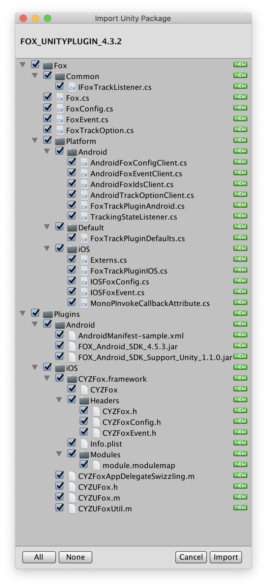

[TOP](../../README.md)　>　**Unityプラグインの導入手順**

---

## Unityプラグインの導入手順

### Unityプラグインのプロジェクトへの追加

1. Unityを起動し、プラグインを組み込むUnityプロジェクトを選択
2. メニューの「Assets」>「Import Package」>「Custom Package」を選択する
3. 「FOX_UNITYPLUGIN_&lt;version&gt;.unitypackage」を選択する
4. 「All」ボタンを押下し、全てにチェックを付ける
5. iOS用プラグインが不要な場合は、`Fox/iOS`と`Plugins/iOS`のチェックを外す
6. Android用プラグインが不要な場合は、`Fox/Android`と`Plugins/Android`のチェックを外す
7. 「Import」ボタンを押下する

> ※ `FOX_UNITYPLUGIN_<version>.unitypackage`には最新のネイティブ版SDK(iOS/Android)が同梱されています。

> リエンゲージメント計測を実施しない場合は、FoxReengagePlugin.h, FoxReengagePlugin.mをインポートしないでください。

### iOS

> [iOS プロジェクトの詳細設定](./ios/README.md)

### Android

> [Android プロジェクトの詳細設定](./android/README.md)

---
[トップ](../../README.md)
