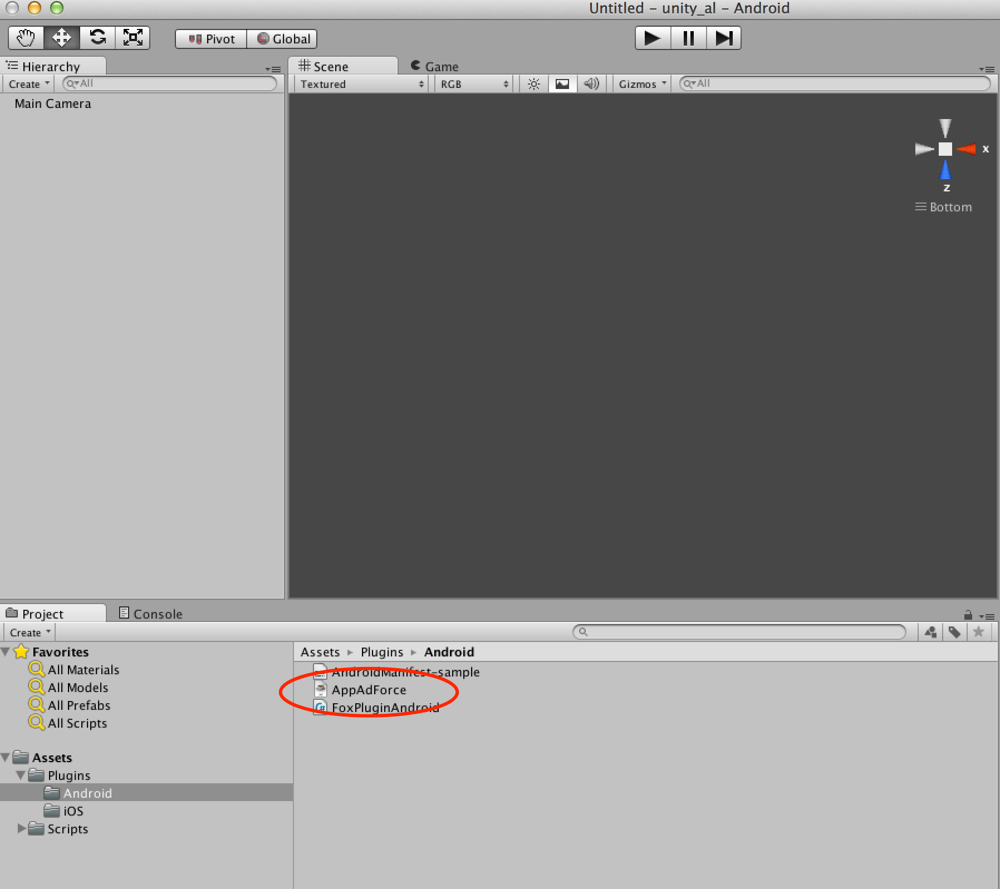

## Unityプラグイン導入手順

### Unityプラグインのプロジェクトへの追加

1. Unityを起動し、プラグインを組み込むUnityプロジェクトを選択
2. メニューの「Assets」>「Import Package」>「Custom Package」を選択する
3. 「FOX-UnityPlugin_<version>.unitypackage」を選択する
4. 「All」ボタンを押下し、全てにチェックを付ける
5. iOS用プラグインが不要な場合は、「Plugins/iOS」のチェックを外す
6. Android用プラグインが不要な場合は、「Plugins/Android」のチェックを外す
7. 「Import」ボタンを押下する

> iOSでF.O.Xのプッシュ通知を利用しない場合は、FoxNotifyPlugin.h, FoxNotifyPlugin.mをインポートしないでください。また、リエンゲージメント計測を実施しない場合は、FoxReengagePlugin.h, FoxReengagePlugin.mをインポートしないでください。

### ネイティブ用のSDKの組み込み

F.O.XのiOS SDK, Android SDKを組み込みます。

* **Android SDKの導入手順**

「FOX Android SDK_<version>」に含まれる「AppAdForce.jar」を導入します。

「Plugins/Android」フォルダにAppAdForce.jarをドラッグして、コピーします。

> AndroidでF.O.Xのプッシュ通知機能を利用する場合は、gcm.jarの導入が必要となります。
gcm.jarを導入していない場合は、「FOX Android SDK_<version>」に含まれる「gcm.jar」をプロジェクトに導入してください。

* **iOS SDKの導入手順**

「FOX_iOS_SDK_<version>」以下に含まれる全てのファイルをドラッグして、Unityの「Plugins/iOS」フォルダに組み込みます。

* **iOS9における導入の注意点**

> Cookie計測を実施する際に、iOS9ではSFSafariViewControllerを使用します。
F.O.X Unity SDK v2.16以降では、SFSafariViewController起動後の制御をFoxReengagePluginで行うため導入が必須となります。

> これまで外されていた場合には、本Unity SDKのunitypackageファイルに同梱のFoxReengagePluginをご導入ください。

---
[TOPへ](/lang/ja/)
