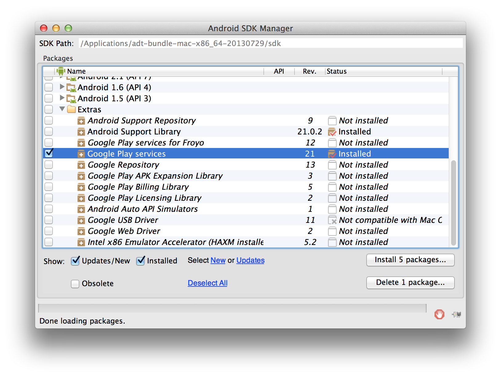

# 광고ID를 이용하기 위한 Google Play Services SDK의 도입


## Google Play 개발자 프로그램 준수

Force Operation X And​​roid SDK는 Google Play 개발자 프로그램 정책을 준수하고 있습니다. 이 SDK는 정책을 준수하기 위해 영구적인 디바이스 ID (IMEI, MAC어드레스 및 AndroidID)를  취득하는 경우에는 광고ID가 취득 되지 않습니다. 2014년 8월 1일부터 Google Play 스토어에 업로드 된 모든 업데이트와 새로운 앱은 광고목적으로 사용하는 단말ID는 광고ID를 이용할 필요가 있습니다.본 정책을 준수하기 위해 아래의 단계를 수행하십시오.


## Google Play Services SDK


광고ID를 사용할 수 있도록 하기위해 Google Play Services SDK가 포함될 필요가 있습니다.
응용 프로그램에 Google Play Services SDK가 포함되어 있지 않은 경우에는 다음 사이트의 지침에 따라 설치를해야합니다.

[Setting Up Google Play Services | Android Developers](https://developer.android.com/google/play-services/setup.html)


## Google Play Services SDK의 취득

아래의 2014년 12월 시점의 Google Play Services SDK의 도입 방법을 기재합니다.


Google Play Services SDK를 설치하지 않은 경우 Android SDK Manager에서 패키지를 취득합니다.

* Android SDK Manager를 기동합니다.
* Extras 디렉토리의 Google Play services에 체크를 넣고 패키지를 설치합니다.



## Google Play Services의 도입

Google Play Services 의 라이브러리 프로​​젝트를 취득하면 Unity프로젝트의Plugins/Android 폴더에 ${ANDROID_SDK_PATH}/extras/google/google_play_services/libproject/google-play-services_lib를 복사 하십시오.


## Google Play Services를 이용하기위한 설정

#### AndroidManifest.xml 편집

Google Play Services를 이용하기 위해서는 아래의 설정을 AndroidManifest.xml의<application> 태그 내에 기술합니다.

```xml
<meta-data
    android:name="com.google.android.gms.version"
    android:value="@integer/google_play_services_version" />
```

#### Proguard 설정

Proguard를 이용해서 읽기 어렵게 된 경우에는 다음 설정을 추가하십시오.

```
-keep class * extends java.util.ListResourceBundle {
    protected Object[][] getContents ();
}

-keep public class com.google.android.gms.common.internal.safeparcel.SafeParcelable {
    public static final *** NULL;
}

-keepnames @com.google.android.gms.common.annotation.KeepName class *
-keepclassmembernames class * {
    @com.google.android.gms.common.annotation.KeepName *;
}

-keepnames class * implements android.os.Parcelable {
    public static final ** CREATOR;
}
```

---
[TOP](/lang/ko/doc/README.md)
