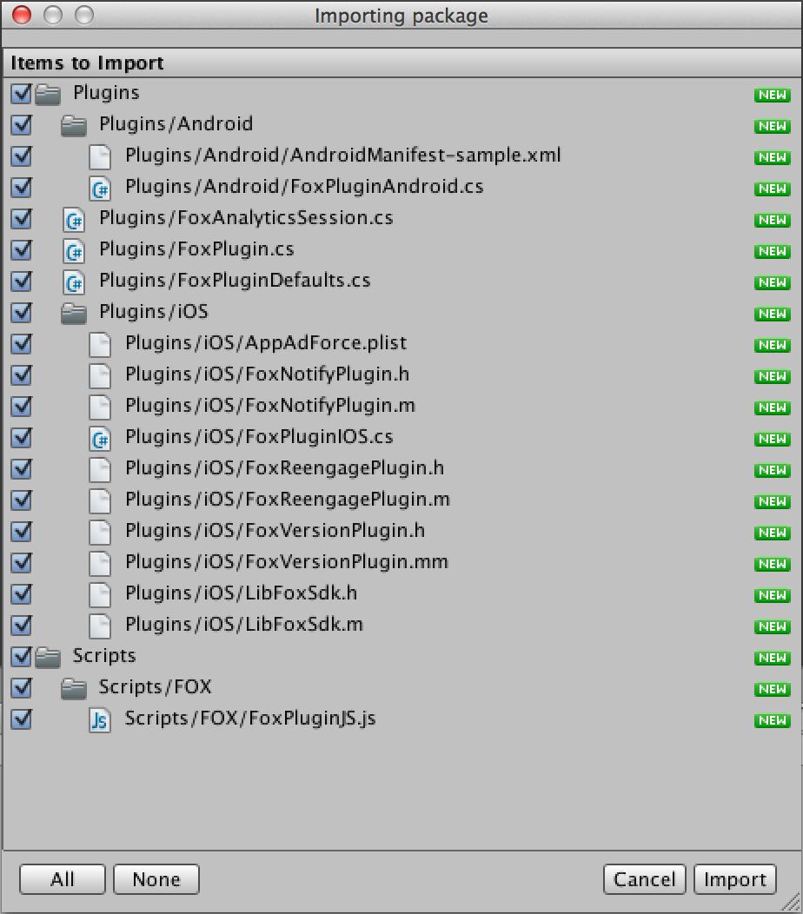

[TOP](../../README.md)　>　**Unity 플러그인의 도입 절차**

---

## Unity 플러그인의 도입 절차

### Unity 플러그인의 프로젝트에 추가

1. Unity를 기동하여 플러그인을 도입할 Unity 프로젝트를 선택
2. 메뉴의 「Assets」>「Import Package」>「Custom Package」를 선택합니다.
3. 「FOX_UNITYPLUGIN_&lt;version&gt;.unitypackage」를 선택합니다.
4. 「All」버튼을 클릭하여 전부를 체크합니다.
5. iOS용 플러그인이 불필요한 경우에는 `Fox/iOS`と`Plugins/iOS`의 체크를 제외합니다.
6. Android용 플러그인이 불필요한 경우에는 `Fox/Android`과`Plugins/Android`의 체크를 제외합니다.
7. 「Import」버튼을 클릭합니다.

> ※ `FOX_UNITYPLUGIN_<version>.unitypackage`에는 최신의 네이티브용 SDK(iOS/Android)가 동봉되어 있습니다.

> 리엔게이지멘트 계측을 실시하지 않는 경우에는 FoxReengagePlugin.h, FoxReengagePlugin.m를 임포트하지 말아 주십시오

### iOS

> [iOS 프로젝트의 상세 설정](./ios/README.md)

### Android

> [Android 프로젝트의 상세 설정](./android/README.md)

---
[톱](../../README.md)
