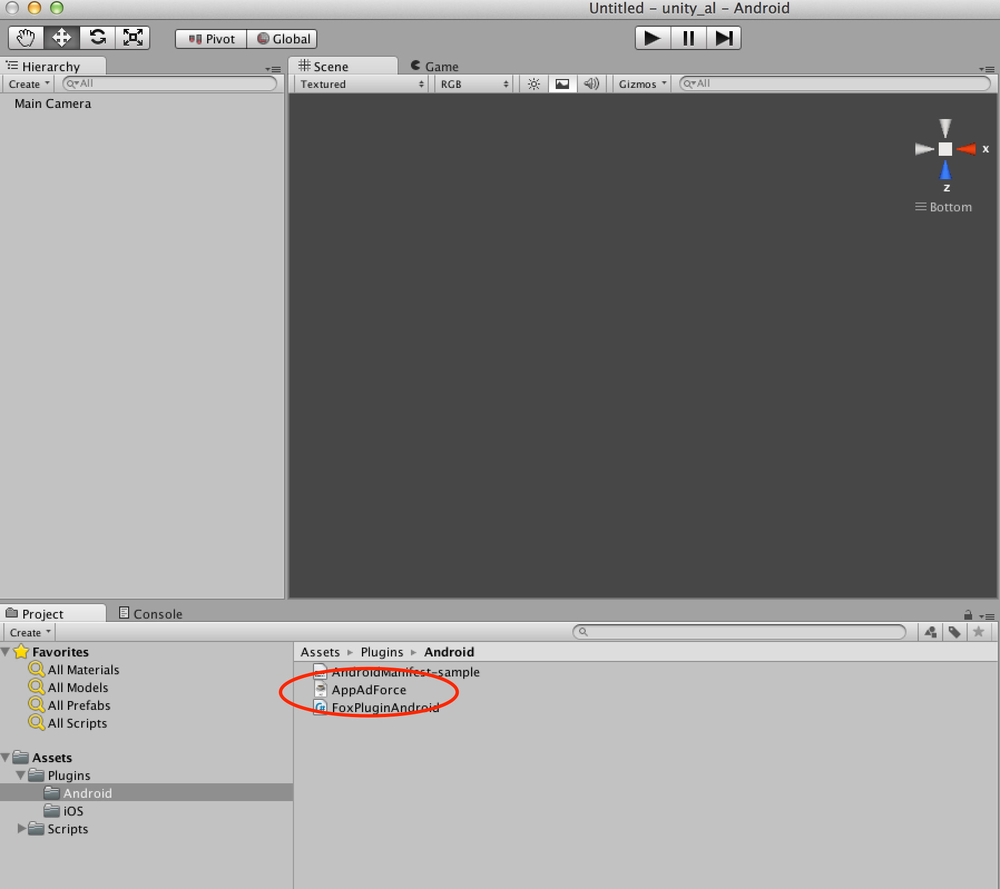
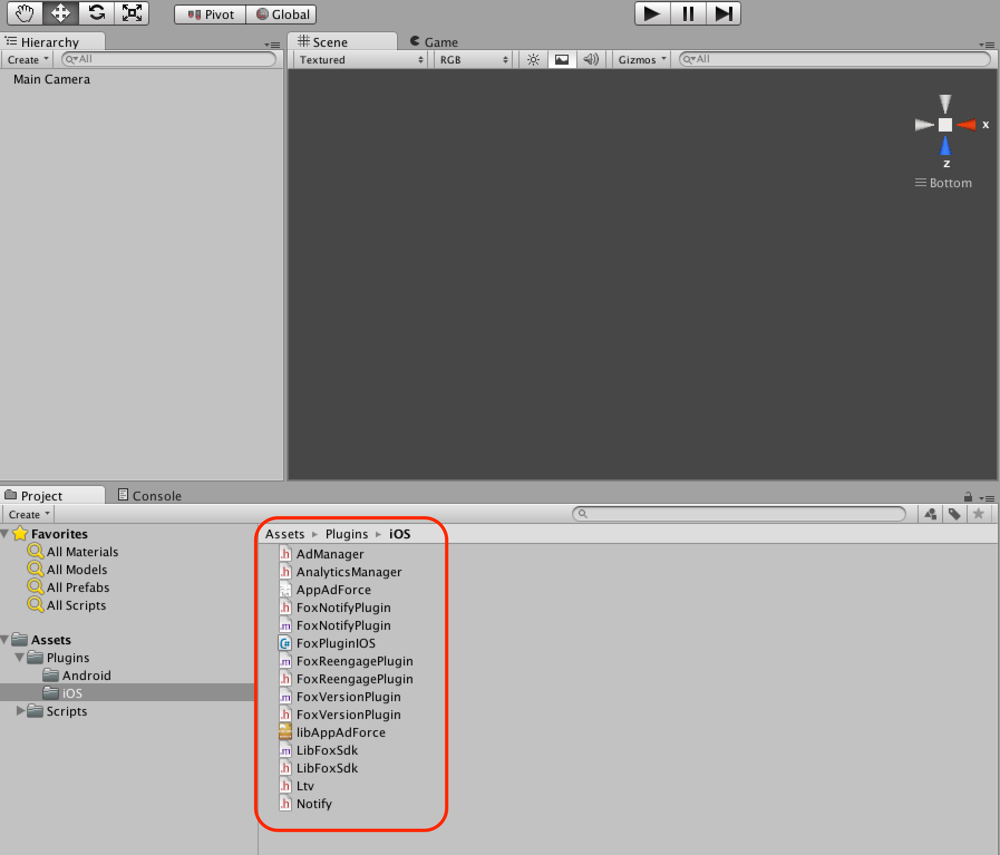

## Unity 플러그인 도입 절차

### Unity 플러그인 프로젝트에 추가

1. Unity을 시작하고 플러그인을 통합Unity 프로젝트를 선택
2. 메뉴의 「Assets」 > 「Import Package」> 「Custom Package」를 선택
3. 「FOX-UnityPlugin_<version>.unitypackage」를 선택
4. 「All」버튼을 클릭하고 모든 항목에 체크
5. iOS용 플러그인이 불필요한 경우에는 「Plugins/iOS」의 체크를 해제
6. Android용 플러그인이 불필요한 경우는 「Plugins/Android」의 체크를 해제
7. 「Import」버튼을 클릭

> iOS에서 F.O.​​X의 푸시 알림을 사용하지 않을 경우 FoxNotifyPlugin.h, FoxNotifyPlugin.m를 import 하지 마십시오. 또 Engagement 측정을 실시하지 않는 경우 FoxReengagePlugin.h, FoxReengagePlugin.m을 import 하지 마십시오.

### 네이티브용 SDK 내장

F.O.X의 iOS SDK, Android SDK를 도입합니다.

* **Android SDK의 도입 단계**

「FOX And​​roid SDK_<version>」에 포함된 「AppAdForce.jar」를 도입합니다.

「Plugins/Android」폴더에 AppAdForce.jar를 드래그하여 복사합니다.

> Android에서 F.O​.​X의 푸시 알림 기능을 이용하려면 gcm.jar의 도입이 필요합니다.
gcm.jar를 도입하지 않았다면 「FOX And​​roid SDK_ <version>」에 포함된 「gcm.jar」를 프로젝트에 도입 하십시오.

* **iOS SDK의 도입 단계**

「FOX_iOS_SDK_<version>
」아래​​에 포함된 모든 파일을 드래그하여 Unity의 「Plugins/iOS」 폴더에 넣습니다.

---
[TOP](/lang/ko/doc/README.md)
