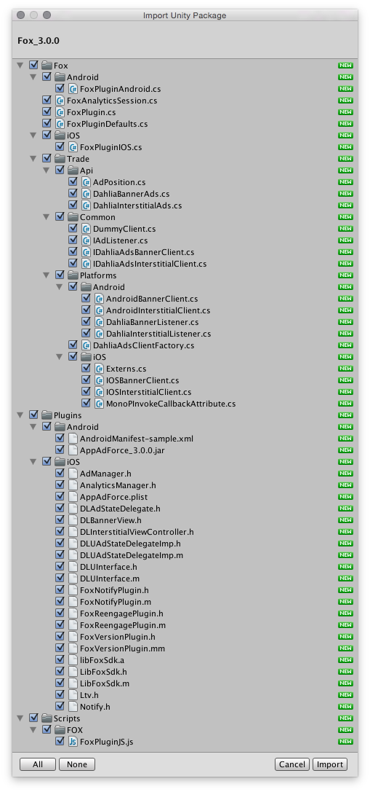

[TOP](../../README.md)　>　**Unity插件的导入步骤**

---

## Unity插件的导入步骤

### 在Unity项目中添加插件

1. 启动Unity，选择要导入插件的Unity项目
2. 菜单中选择「Assets」>「Import Package」>「Custom Package」
3. 选择「FOX_UNITYPLUGIN_&lt;version&gt;.unitypackage」
4. 点击「All」按钮，全部勾选
5. 不需要iOS插件的情况时，不用勾选`Fox/iOS`和`Plugins/iOS`
6. 不需要Android插件的情况时，不用勾选`Fox/Android`和`Plugins/Android`
7. 点击「Import」按钮

> ※ `FOX_UNITYPLUGIN_<version>.unitypackage`中包含最新的原生SDK(iOS/Android)。

> 不进行流失唤回广告计测时，不用导入FoxReengagePlugin.h, FoxReengagePlugin.m。

### iOS

> [iOS项目详细设置](./ios/README.md)

### Android

> [Android项目详细设置](./android/README.md)

---
[Top](../../README.md)
