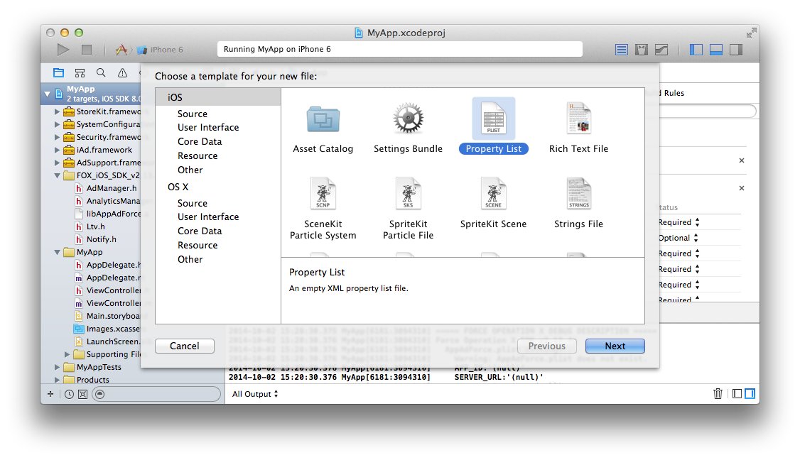
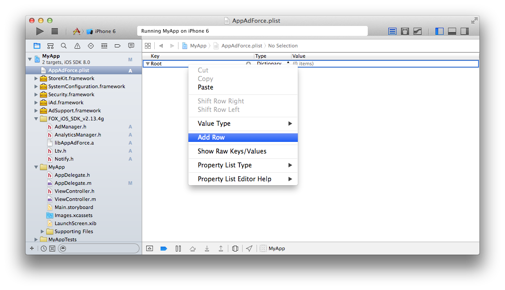
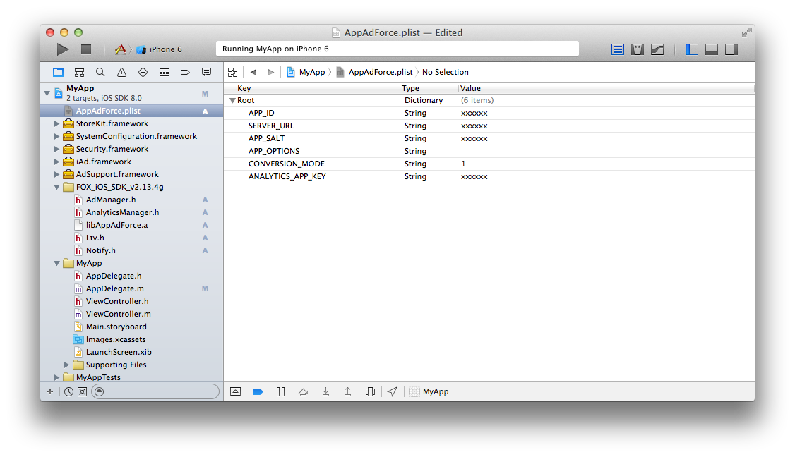

## SDK設定的詳細

追加必要的設定到plist裡讓SDK發揮作用。
請在FOX管理畫面裡（SDK導入→平台的選擇→SDK導入文檔→SDK導入步驟→設定文件的下載）下載設定文件「AppAdForce.plist」，並根據自己項目的需要進行修改。 
也可以按下方所示，新建「AppAdForce.plist」這樣一個Property List文件放到項目的任意一個地方，並手動輸入下面的Key和Value。

在任意地點點擊右鍵→選擇「New File...」

「Property List」を選択。

變更成「AppAdForce.plist」這個名稱、點擊Create按鈕。

選擇新建的Property List文件，用右鍵打開菜單，選擇Add Row」

設定各個Key和Value。

設定的Key和Value如下。

<table>
<tr>
  <th>Key</th>
  <th>Type</th>
  <th>Value</th>
</tr>
<tr>
  <td>APP_ID</td>
  <td>String</td>
  <td>請將由Force Operation X管理者通知的數值輸入。</td>
</tr>
<tr>
  <td>SERVER_URL</td>
  <td>String</td>
  <td>請將由Force Operation X管理者通知的數值輸入。</td>
</tr>
<tr>
  <td>APP_SALT</td>
  <td>String</td>
  <td>請將由Force Operation X管理者通知的數值輸入。</td>
</tr>
<tr>
  <td>APP_OPTIONS</td>
  <td>String</td>
  <td>請空白。</td>
</tr>
<tr>
  <td>CONVERSION_MODE</td>
  <td>String</td>
  <td>1</td>
</tr>
<tr>
  <td>ANALYTICS_APP_KEY</td>
  <td>String</td>
  <td>請將由Force Operation X管理者通知的數值輸入。 不利用流量分析的場合沒有必要設定</td>
</tr>
<tr>
  <td>ANALYTICS_SERVER_URL</td>
  <td>String</td>
  <td>請將由Force Operation X管理者通知的數值輸入。 不利用流量分析的場合沒有必要設定</td>
</tr>
</table>

[AppAdForce.plist範例](/lang/zh-tw/doc/integration/ios/config_plist/AppAdForce.plist)

---
[iOS TOP](../README.md)
