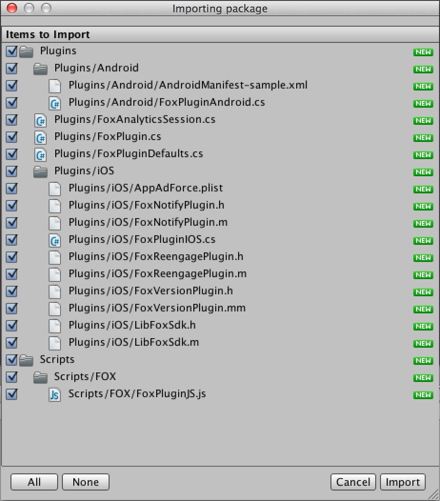
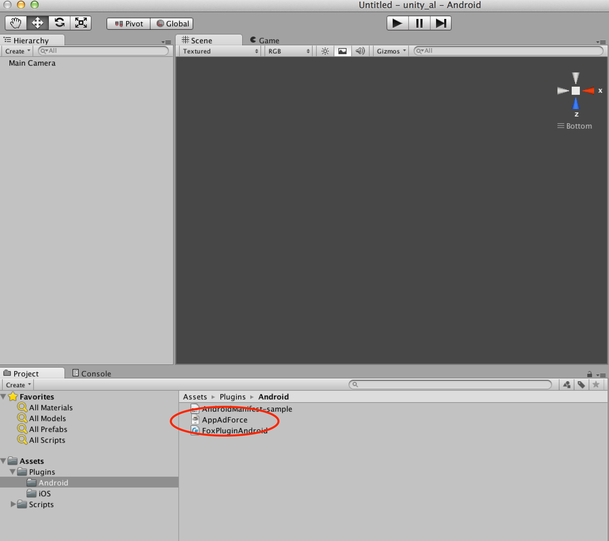

## Unity插件導入步驟

### 在項目裡添加Unity插件

1. 啟動Unity、選擇導入插件的Unity項目
2. 選擇菜單的「Assets」>「Import Package」>「Custom Package」
3. 選擇「FOX-UnityPlugin_&lt;version&gt;.unitypackage」
4. 按下「All」按鈕、全部勾選
5. 如果不需要iOS的插件、請去掉「Plugins/iOS」的選項。
6. 如果不需要Android的插件、請去掉「Plugins/Android」的選項。
7. 按下「Import」按鈕。

> 如果不想進行F.O.X的Reengagement計測，請不要導入FoxReengagePlugin.h, FoxReengagePlugin.m

### 導入Native用的SDK

導入F.O.X的iOS SDK和Android SDK。

* **Android SDK的導入步驟**

導入「FOX Android SDK_&lt;version&gt;」裡的「AppAdForce.jar」。

把AppAdForce.jar拖拽並拷貝到「Plugins/Android」文件夾裡。

* **iOS SDK的導入步驟**

拖拽「FOX_iOS_SDK_&lt;version&gt;」下面的所有文件來導入到Unity的「Plugins/iOS」文件夾下。

**在iOS9環境導入的注意點**

> 進行Cookie計測的時候，在iOS9環境裡使用SFSafariViewController。
F.O.X Unity SDK v2.16及以後版本，是靠FoxReengagePlugin做SFSafariViewController啟動後的控制，所以必須導入。

> 如果到此都沒有安裝，請導入同捆的FoxReengagePlugin到這個Unity SDK的unitypackage文件裡。

> ※從iOS9開始，從初回啟動時的瀏覽器啟動到返回APP的時候，會彈出對話框。F.O.X SDK從iOS9開始發布了新的WebView形式，在初回啟動時啟動這個新形式的“SFSafariViewController”來進行計測。在內部控制SFSafariViewController需要`FoxReengagePlugin`，所以若是支持iOS9的APP請務必導入。

---
[TOP](/lang/zh-tw/README.md)
